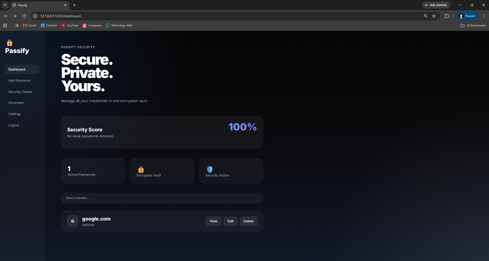
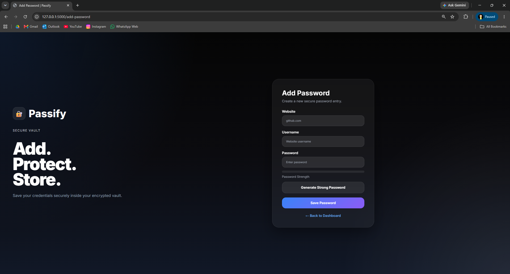
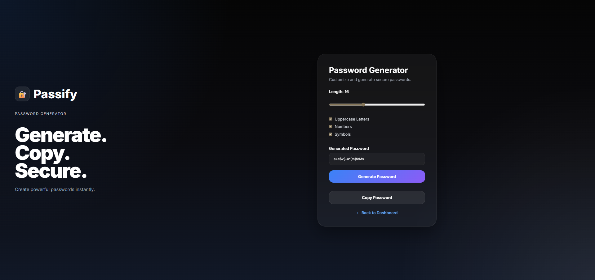
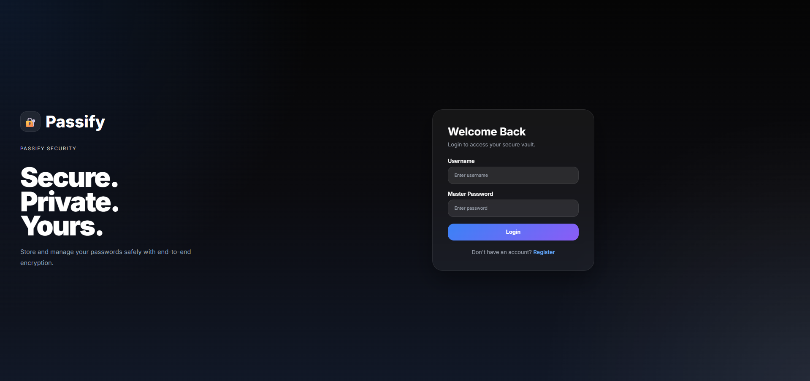
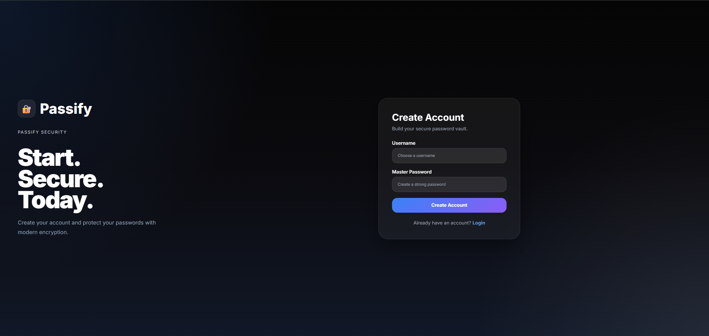

# Passify

A secure password manager built with Flask.

Features:
- User Authentication
- Password Encryption
- Password Generator
- Security Center
- Password Strength Analysis
- Password Reuse Detection

Tech Stack:
- Python
- Flask
- SQLite
- Cryptography

Dashboard UI

Add Password UI

Password Generator UI

Login Page UI

Register Page UI
